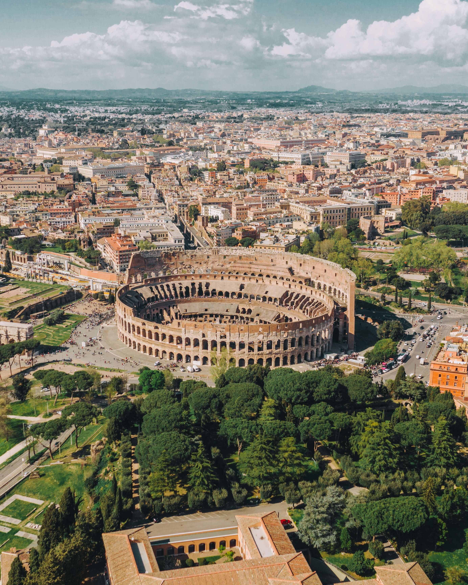

# My Title <!-- omit in toc -->

This is a very short introduction.

### Table of contents <!-- omit in toc -->

- [Chapter 1](#chapter-1)
- [Chapter 2](#chapter-2)
- [Chapter 3](#chapter-3)
- [Highlighting](#highlighting)
- [Links](#links)
- [Images](#images)
- [Lists](#lists)
- [Tables](#tables)
## Chapter 1

This is my first paragraph.

## Chapter 2

This is my second paragraph.

## Chapter 3

This is my third paragraph.

## Highlighting

We use optional cookies to **improve your experience** on our websites, such as through social media connections, and to display _personalized advertising_ based on your online activity.

> If you **reject** optional cookies, only cookies necessary to provide you the services will be used.

> You may **change** your selection by clicking “Manage Cookies” at the bottom of the page. _Privacy Statement Third-Party Cookies_.

This is our pattern: `x+y=z`

This is a code example:

```
def click_submit_button(self):
    self.click_on_the_element(self.submit_button_xpath)
```

```
def click_clear_button(self):
    self.click_on_the_element(self.clear_button_xpath)
```

## Links

[Blog](https://code.visualstudio.com/blogs/2023/07/20/mangling-vscode)
[https://code.visualstudio.com/blogs/2023/07/20/mangling-vscode]

## Images




## Lists

1. one
2. two
3. tree

- four
- five
- six

## Tables

This is a new paragraph.

| Heading text | Definition text |
| ------------ | --------------- |
| Item A       | Definition of A |
| Item B       | Definition of B |

This is another paragraph.
